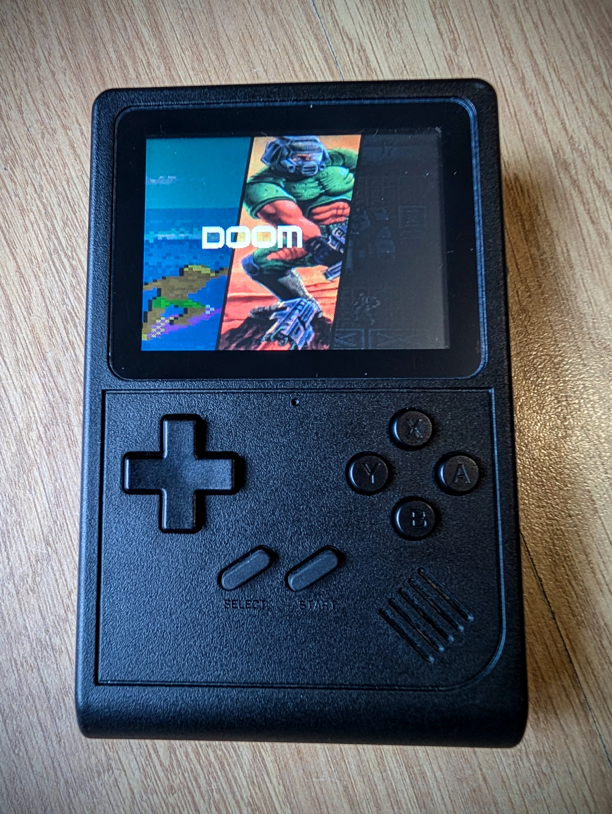
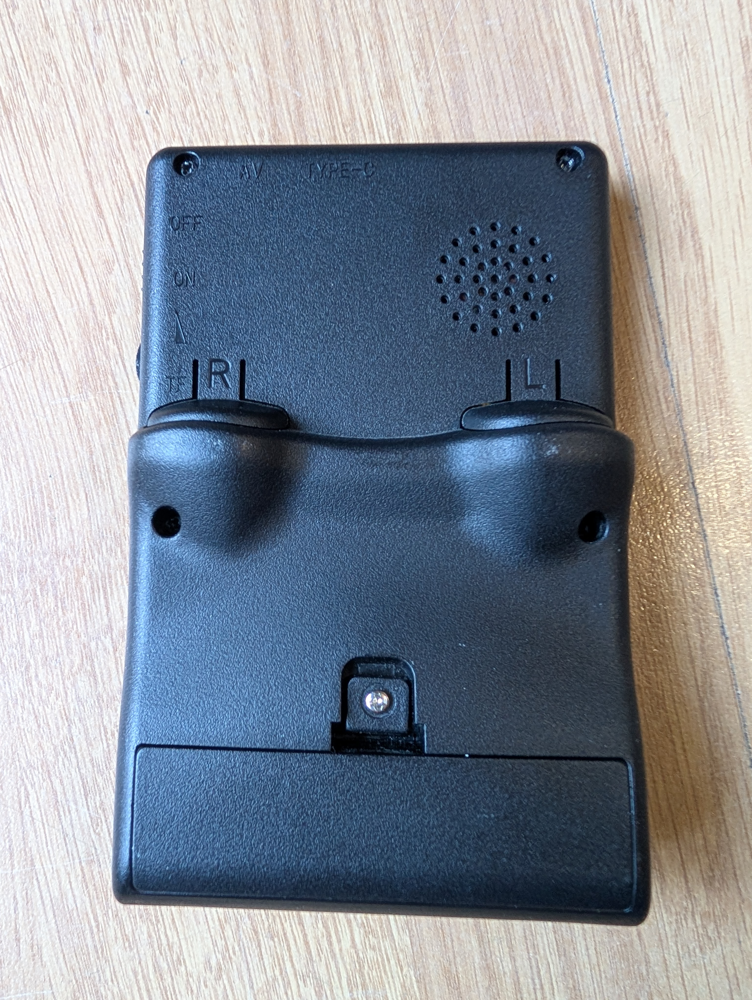

# Martendo32
- Build Guide & BOM: https://github.com/hagbardZ/Martendo32
- Status: Complete

Command to build (ESP-IDF v5.5): `python rg_tool.py --target martendo32 build-img --no-networking`

## Hardware
- Martendo32
- Wireless-Tag ESP32-P4 WT0132P4-A1-N16R32
- ST7789V 320*240 2.8" SPI Display 
- SD card over SDMMC (4 bits)
- NS4168 DAC
- TP4056 charge chip
- 2.5mm audio jack
- Volume wheel
- USB-C for charging and firmware updates

## Images

